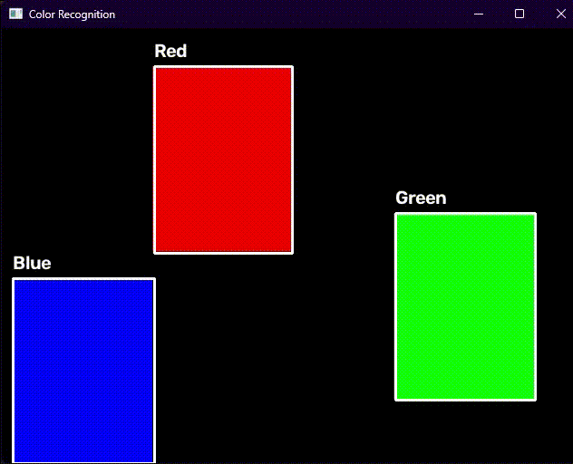

# OpenCV Color Recognition

## Overview

This project demonstrates real-time color recognition using OpenCV and Python.

The system captures video from a webcam, detects colored objects, and identifies them as Red, Green, or Blue. A bounding box is drawn around each detected object and the corresponding color name is displayed on the screen.

This project was developed as part of an Artificial Intelligence and Computer Vision training task.

---

## Features

- Real-time color detection
- Recognition of Red, Green, and Blue colors
- Bounding box visualization
- Color label display
- Webcam-based input
- OpenCV image processing

---

## Technologies Used

- Python 3
- OpenCV
- NumPy

---

## Requirements

Before running the project, install the following:

- Python 3.x
- OpenCV
- NumPy
- Webcam

---

## Installation

Install the required libraries:

```bash
pip install opencv-python numpy
```

---

## Project Structure

```text
opencv_color_recognition/
│
├── color.py
├── requirements.txt
├── screenshot.png
├── demo.gif
└── README.md
```

---

## Usage

Run the Python script:

```bash
python color.py
```

Show a red, green, or blue object to the camera.

The program will detect the color and display its name on the screen.

Press **Q** to close the application.

---

## Color Recognition Process

1. Capture video frames from the webcam.
2. Convert the image from BGR to HSV color space.
3. Create masks for Red, Green, and Blue colors.
4. Detect contours of colored objects.
5. Draw bounding boxes around detected objects.
6. Display the detected color name.

---

## Demo

<p align="center">
  
</p>

---

## Results

The system successfully detects and recognizes:

- Red objects
- Green objects
- Blue objects

Detected objects are highlighted with a bounding box and labeled with their corresponding color name.

---

## Author

V
